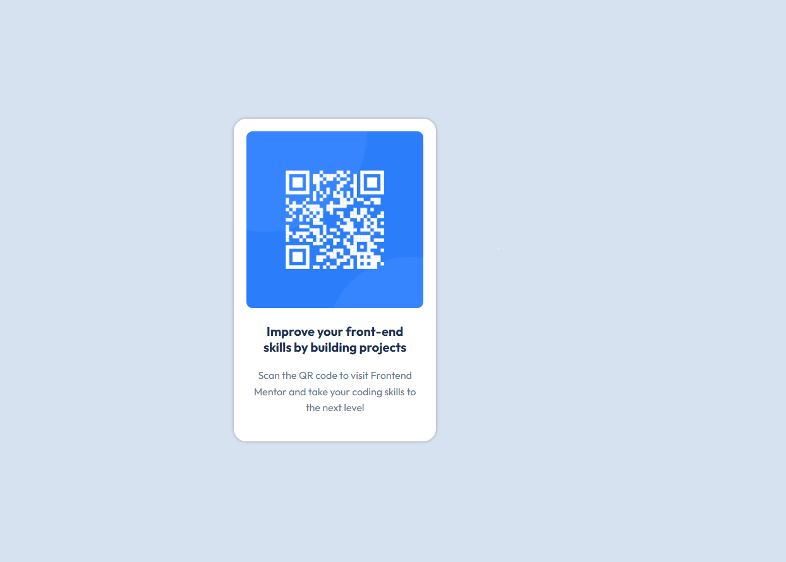

# Frontend Mentor - QR Code Component Challenge Solution

This is a solution to the [QR Code Component challenge on Frontend Mentor](https://www.frontendmentor.io/challenges/qr-code-component-iux_sIO_H). Frontend Mentor challenges help you improve your coding skills by building realistic projects.

## Table of Contents

- [Overview](#overview)
  - [The Challenge](#the-challenge)
  - [Screenshot](#screenshot)
  - [Links](#links)
- [My Process](#my-process)
  - [Built With](#built-with)
  - [What I Learned](#what-i-learned)
  - [Continued Development](#continued-development)
  - [Useful Resources](#useful-resources)
- [Author](#author)

## Overview

### The Challenge

Users should be able to:

- View the optimal layout depending on their device's screen size

### Screenshot




### Links

- Solution URL: [GitHub Repository](https://github.com/sylviacool/qr-code-component)
- Live Site URL: [Netlify](https://qr-code-180.netlify.app/)

## My Process

### Built With

- Semantic HTML5 markup
- CSS custom properties
- Flexbox
- Mobile-first workflow

### What I Learned

During this project, I practiced implementing a mobile-first workflow and styling components using flexbox. The display: flex property made it easier to align items in the container both vertically and horizontally. The flex-direction: column helped stack elements vertically, which is essential for mobile responsiveness. I also used justify-content and align-items to center the items in the container, ensuring the design looks great on both small and large screens.For example:

```css
.container {
  display: flex; /* Using flexbox to align content */
  flex-direction: column; /* Stack items vertically */
  justify-content: center; /* Center items along the main axis */
  align-items: center; /* Center items along the cross axis */
  height: 100vh; /* Make the container take the full viewport height */
}


----

## Author

- Live Site: [QR Code Component](https://qr-code-180.netlify.app/)
- Frontend Mentor: [@sylviacool](https://www.frontendmentor.io/profile/sylviacool)
- GitHub: [@sylviacool](https://github.com/sylviacool)
